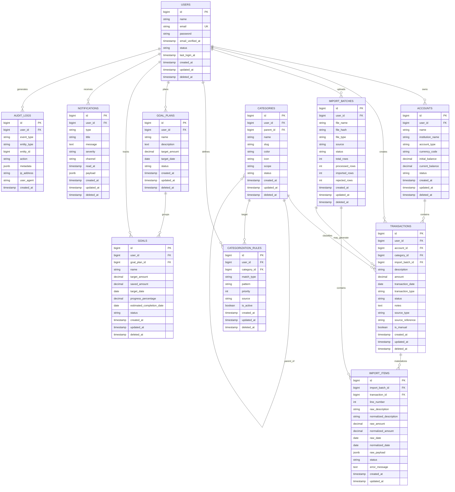

# DATABASE.md

# Banco de Dados Oficial do Orbit

Este documento define o modelo de dados oficial do Orbit.

Ele descreve:

* modelo conceitual;
* modelo lógico;
* entidades;
* relacionamentos;
* atributos;
* chaves primárias;
* chaves estrangeiras;
* índices;
* constraints;
* estratégia de RLS;
* diagrama ER;
* justificativa de cada entidade.

Não são geradas migrations neste documento.

---

# 1. Modelo Conceitual

O Orbit é um sistema financeiro centrado em usuário, no qual cada pessoa possui contas, transações, importações, categorias, metas, notificações e regras de categorização próprias.

O modelo conceitual é orientado aos seguintes conceitos:

* um usuário controla seu próprio universo financeiro;
* contas armazenam o contexto de origem ou destino financeiro;
* transações representam eventos financeiros persistidos;
* importações registram lotes de entrada externa;
* categorias classificam transações;
* regras de categorização personalizam o comportamento do sistema;
* metas acompanham objetivos financeiros;
* notificações registram alertas do domínio;
* trilhas de auditoria preservam rastreabilidade.

O conceito central é que a transação é a fonte da verdade operacional do dia a dia, enquanto importações, regras, metas e notificações orbitam esse núcleo.

---

# 2. Modelo Lógico

O modelo lógico está organizado em tabelas relacionais normalizadas, com separação entre:

* identidade do usuário;
* contas financeiras;
* categorias;
* transações;
* importações;
* itens importados;
* metas;
* regras de categorização;
* notificações;
* auditoria;
* recuperação de senha.

Estratégia geral:

* entidades principais em tabelas próprias;
* relações por chave estrangeira;
* soft delete quando houver necessidade de preservação histórica;
* timestamps em todas as tabelas relevantes;
* campos derivados evitados como fonte primária de verdade;
* agregações de dashboard calculadas a partir de transações e metas.

---

# 3. Entidades

## 3.1 users

### Finalidade

Armazenar a identidade do usuário autenticado.

### Atributos

* `id`
* `name`
* `email`
* `email_verified_at`
* `password`
* `status`
* `last_login_at`
* `created_at`
* `updated_at`
* `deleted_at` quando aplicável

### Chave primária

* `id`

### Chaves estrangeiras

* nenhuma obrigatória no núcleo

### Constraints

* `email` único
* `name` obrigatório
* `password` obrigatório
* `status` com domínio controlado

### Índices

* índice único em `email`
* índice em `status`

### Justificativa

O usuário é a raiz de posse de todos os dados financeiros. A separação dessa entidade permite isolamento de dados, autorização por proprietário e suporte a evolução futura.

---

## 3.2 accounts

### Finalidade

Representar contas financeiras do usuário, como conta corrente, carteira, poupança ou similares.

### Atributos

* `id`
* `user_id`
* `name`
* `institution_name`
* `account_type`
* `currency_code`
* `initial_balance`
* `current_balance` quando persistido como snapshot
* `status`
* `created_at`
* `updated_at`
* `deleted_at` quando aplicável

### Chave primária

* `id`

### Chaves estrangeiras

* `user_id` → `users.id`

### Constraints

* `name` obrigatório
* `user_id` obrigatório
* `account_type` com domínio controlado
* `currency_code` com domínio controlado
* unicidade recomendada por usuário e nome da conta, quando fizer sentido

### Índices

* índice em `user_id`
* índice composto em `user_id`, `status`

### Justificativa

Contas são o ponto de agrupamento das transações e permitem calcular saldos, filtrar por origem e organizar o patrimônio do usuário.

---

## 3.3 categories

### Finalidade

Classificar transações em grupos semânticos como alimentação, transporte e assinaturas.

### Atributos

* `id`
* `user_id` nullable para categorias globais ou personalizadas
* `name`
* `slug`
* `color`
* `icon`
* `parent_id` nullable
* `scope`
* `status`
* `created_at`
* `updated_at`
* `deleted_at` quando aplicável

### Chave primária

* `id`

### Chaves estrangeiras

* `user_id` → `users.id` nullable
* `parent_id` → `categories.id` nullable

### Constraints

* `name` obrigatório
* `scope` com domínio controlado
* `slug` único por escopo ou por usuário, conforme regra final

### Índices

* índice em `user_id`
* índice em `parent_id`
* índice em `scope`
* índice único recomendado em `slug` com recorte de escopo

### Justificativa

Categorias precisam existir como entidades independentes para suportar hierarquia, regras globais, personalização por usuário e reaprendizado baseado em correções manuais.

---

## 3.4 transactions

### Finalidade

Armazenar os movimentos financeiros do usuário.

### Atributos

* `id`
* `user_id`
* `account_id`
* `category_id` nullable
* `import_batch_id` nullable
* `description`
* `amount`
* `transaction_date`
* `transaction_type`
* `status`
* `notes`
* `source_type`
* `source_reference` nullable
* `is_manual`
* `created_at`
* `updated_at`
* `deleted_at` quando aplicável

### Chave primária

* `id`

### Chaves estrangeiras

* `user_id` → `users.id`
* `account_id` → `accounts.id`
* `category_id` → `categories.id` nullable
* `import_batch_id` → `import_batches.id` nullable

### Constraints

* `description` obrigatório
* `amount` obrigatório
* `transaction_date` obrigatório
* `transaction_type` com domínio controlado
* `source_type` com domínio controlado
* `user_id` obrigatório
* `account_id` obrigatório

### Índices

* índice em `user_id`
* índice em `account_id`
* índice em `category_id`
* índice em `import_batch_id`
* índice em `transaction_date`
* índice composto em `user_id`, `transaction_date`
* índice composto em `user_id`, `account_id`, `transaction_date`

### Justificativa

Transações são o núcleo analítico do sistema. Quase todo cálculo do dashboard, metas e notificações depende dessa entidade.

---

## 3.5 import_batches

### Finalidade

Registrar o lote de importação de arquivo externo.

### Atributos

* `id`
* `user_id`
* `file_name`
* `file_hash`
* `file_type`
* `source`
* `status`
* `total_rows`
* `processed_rows`
* `imported_rows`
* `rejected_rows`
* `created_at`
* `updated_at`
* `deleted_at` quando aplicável

### Chave primária

* `id`

### Chaves estrangeiras

* `user_id` → `users.id`

### Constraints

* `user_id` obrigatório
* `file_name` obrigatório
* `file_hash` obrigatório
* `status` com domínio controlado

### Índices

* índice em `user_id`
* índice em `file_hash`
* índice em `status`

### Justificativa

Importações devem ser armazenadas separadamente das transações para garantir rastreabilidade, auditoria e idempotência.

---

## 3.6 import_items

### Finalidade

Registrar cada linha interpretada de uma importação.

### Atributos

* `id`
* `import_batch_id`
* `transaction_id` nullable
* `line_number`
* `raw_description`
* `normalized_description`
* `raw_amount`
* `normalized_amount`
* `raw_date`
* `normalized_date`
* `raw_payload` jsonb
* `status`
* `error_message` nullable
* `created_at`
* `updated_at`

### Chave primária

* `id`

### Chaves estrangeiras

* `import_batch_id` → `import_batches.id`
* `transaction_id` → `transactions.id` nullable

### Constraints

* `import_batch_id` obrigatório
* `line_number` obrigatório
* `status` com domínio controlado
* unicidade recomendada por `import_batch_id` + `line_number`

### Índices

* índice em `import_batch_id`
* índice em `transaction_id`
* índice composto em `import_batch_id`, `line_number`

### Justificativa

Os itens importados preservam o detalhe bruto da entrada, facilitando auditoria, depuração de parsing e identificação de linhas inválidas.

---

## 3.7 categorization_rules

### Finalidade

Armazenar regras determinísticas de categorização por palavras-chave e preferências do usuário.

### Atributos

* `id`
* `user_id` nullable
* `category_id`
* `match_type`
* `pattern`
* `priority`
* `source`
* `is_active`
* `created_at`
* `updated_at`
* `deleted_at` quando aplicável

### Chave primária

* `id`

### Chaves estrangeiras

* `user_id` → `users.id` nullable
* `category_id` → `categories.id`

### Constraints

* `category_id` obrigatório
* `pattern` obrigatório
* `match_type` com domínio controlado
* `priority` obrigatório
* `source` com domínio controlado

### Índices

* índice em `user_id`
* índice em `category_id`
* índice em `priority`
* índice em `is_active`

### Justificativa

As regras de categorização são a base do MVP e precisam suportar regras globais e personalizadas por usuário sem recorrer a machine learning.

---

## 3.8 goal_plans

### Finalidade

Representar o plano macro de um objetivo financeiro.

### Atributos

* `id`
* `user_id`
* `name`
* `description`
* `target_amount`
* `target_date`
* `status`
* `created_at`
* `updated_at`
* `deleted_at` quando aplicável

### Chave primária

* `id`

### Chaves estrangeiras

* `user_id` → `users.id`

### Constraints

* `user_id` obrigatório
* `name` obrigatório
* `target_amount` obrigatório e positivo
* `target_date` obrigatório
* `status` com domínio controlado

### Índices

* índice em `user_id`
* índice em `status`
* índice em `target_date`

### Justificativa

O plano de metas organiza o objetivo do usuário em nível de planejamento, antes da granularidade da meta individual ou acompanhamento.

---

## 3.9 goals

### Finalidade

Acompanhar a execução e o progresso de uma meta financeira.

### Atributos

* `id`
* `user_id`
* `goal_plan_id` nullable
* `name`
* `target_amount`
* `saved_amount`
* `target_date`
* `progress_percentage`
* `estimated_completion_date` nullable
* `status`
* `created_at`
* `updated_at`
* `deleted_at` quando aplicável

### Chave primária

* `id`

### Chaves estrangeiras

* `user_id` → `users.id`
* `goal_plan_id` → `goal_plans.id` nullable

### Constraints

* `user_id` obrigatório
* `name` obrigatório
* `target_amount` obrigatório e positivo
* `saved_amount` com default zero
* `progress_percentage` entre 0 e 100

### Índices

* índice em `user_id`
* índice em `goal_plan_id`
* índice em `status`
* índice em `target_date`

### Justificativa

Goals precisam ser independentes do plano para suportar acompanhamento concreto, progresso, alertas e projeções.

---

## 3.10 notifications

### Finalidade

Registrar alertas gerados pelo sistema para o usuário.

### Atributos

* `id`
* `user_id`
* `type`
* `title`
* `message`
* `severity`
* `channel`
* `read_at` nullable
* `payload` jsonb nullable
* `created_at`
* `updated_at`
* `deleted_at` quando aplicável

### Chave primária

* `id`

### Chaves estrangeiras

* `user_id` → `users.id`

### Constraints

* `user_id` obrigatório
* `type` obrigatório
* `title` obrigatório
* `message` obrigatório
* `severity` com domínio controlado
* `channel` com domínio controlado

### Índices

* índice em `user_id`
* índice em `read_at`
* índice em `type`
* índice em `severity`

### Justificativa

Notificações precisam ser persistidas para garantir histórico, leitura posterior e integração com alertas de metas, contas e orçamento.

---

## 3.11 audit_logs

### Finalidade

Registrar eventos relevantes do sistema para rastreabilidade.

### Atributos

* `id`
* `user_id` nullable
* `event_type`
* `entity_type`
* `entity_id` nullable
* `action`
* `metadata` jsonb nullable
* `ip_address` nullable
* `user_agent` nullable
* `created_at`

### Chave primária

* `id`

### Chaves estrangeiras

* `user_id` → `users.id` nullable

### Constraints

* `event_type` obrigatório
* `entity_type` obrigatório
* `action` obrigatório

### Índices

* índice em `user_id`
* índice em `event_type`
* índice em `entity_type`
* índice em `entity_id`
* índice em `created_at`

### Justificativa

Auditoria é essencial para um produto financeiro, principalmente para importações, alterações manuais e eventos de autenticação.

---

## 3.12 password_reset_tokens ou equivalente

### Finalidade

Armazenar ou controlar tokens de recuperação de senha, conforme mecanismo utilizado pelo Laravel.

### Atributos

* `email` ou `user_id`, dependendo da implementação
* `token`
* `created_at`

### Chave primária

* definida pelo mecanismo oficial do framework ou pela tabela equivalente

### Chaves estrangeiras

* `user_id` se adotada tabela própria

### Constraints

* token temporário
* expiração obrigatória

### Índices

* índice em `email` ou `user_id`
* índice em `created_at`

### Justificativa

Recuperação de senha exige persistência temporária e controle de validade para segurança e prevenção de abuso.

---

# 4. Relacionamentos

## Relações principais

* `users` 1:N `accounts`
* `users` 1:N `transactions`
* `users` 1:N `import_batches`
* `users` 1:N `categories` quando a categoria for personalizada
* `users` 1:N `categorization_rules`
* `users` 1:N `goal_plans`
* `users` 1:N `goals`
* `users` 1:N `notifications`
* `users` 1:N `audit_logs`
* `accounts` 1:N `transactions`
* `categories` 1:N `transactions`
* `categories` self-reference `parent_id`
* `import_batches` 1:N `import_items`
* `import_batches` 1:N `transactions` via `import_batch_id`
* `transactions` 1:N `import_items` quando houver materialização do vínculo
* `goal_plans` 1:N `goals`

## Observações de integridade

* todo dado financeiro deve pertencer a um usuário;
* registros importados devem poder ser reconciliados;
* categorias podem ser globais ou personalizadas;
* as tabelas de auditoria não devem permitir ambiguidade de autor quando houver usuário identificado.

---

# 5. Atributos e domínios

## Campos monetários

Campos como `amount`, `initial_balance`, `current_balance`, `target_amount` e `saved_amount` devem usar tipo decimal de precisão adequada ao domínio financeiro.

## Campos de data

Datas transacionais devem ser armazenadas com precisão suficiente para relatórios e filtros.

## Campos de status

Todo campo `status` deve ter domínio controlado por enumeração ou string restrita.

## Campos de tipo

Campos como `transaction_type`, `account_type`, `severity`, `channel`, `source` e `match_type` devem ser restritos a valores conhecidos.

## Campos JSON

Campos como `raw_payload`, `payload` e `metadata` devem ser usados para dados auxiliares e auditáveis, nunca como substituto de colunas estruturadas principais.

---

# 6. Chaves primárias

Padrão geral:

* chave primária técnica `id`
* preferência por identificador numérico ou UUID conforme implementação final

Critérios:

* unicidade garantida
* estabilidade para relacionamentos
* simplicidade para consultas e índices

---

# 7. Chaves estrangeiras

As chaves estrangeiras devem ser aplicadas em todos os relacionamentos persistentes relevantes.

Regras:

* não permitir órfãos em entidades centrais
* usar `nullable` apenas quando o domínio permitir
* proteger referências históricas com `soft delete` em vez de remoção física quando necessário

---

# 8. Índices

## Índices obrigatórios ou fortemente recomendados

* `users.email`
* `accounts.user_id`
* `transactions.user_id`
* `transactions.account_id`
* `transactions.category_id`
* `transactions.import_batch_id`
* `transactions.transaction_date`
* `import_batches.user_id`
* `import_batches.file_hash`
* `import_items.import_batch_id`
* `categorization_rules.user_id`
* `categorization_rules.priority`
* `goals.user_id`
* `goals.target_date`
* `notifications.user_id`
* `notifications.read_at`
* `audit_logs.created_at`

## Índices compostos recomendados

* `transactions.user_id`, `transactions.transaction_date`
* `transactions.user_id`, `transactions.account_id`, `transactions.transaction_date`
* `categories.user_id`, `categories.slug`
* `goals.user_id`, `goals.status`
* `notifications.user_id`, `notifications.read_at`

---

# 9. Constraints

## Constraints de unicidade

* `users.email` único
* `import_batches.file_hash` pode ser único por usuário ou por escopo de origem, se a regra de deduplicação exigir
* `import_items.import_batch_id` + `line_number` único

## Constraints de domínio

* enumeração para status
* enumeração para tipos
* enumeração para origem de regras
* valores monetários positivos quando aplicável
* porcentagem entre 0 e 100 para progresso de metas

## Constraints de integridade

* foreign keys obrigatórias em relacionamentos centrais
* valores nulos apenas quando o domínio permitir
* transações sempre vinculadas a usuário e conta

---

# 10. Estratégia de RLS

## Situação do projeto

O acesso principal ao banco será realizado pelo backend Laravel, não diretamente pelo frontend.

Mesmo assim, a estratégia de Row Level Security é útil como camada adicional de defesa, especialmente caso o banco seja exposto por Supabase ou uso direto de ferramentas externas seja permitido em algum ambiente.

## Diretriz oficial

### Quando RLS deve ser aplicada

* em tabelas com dados por usuário;
* quando houver acesso direto ao PostgreSQL por algum serviço externo;
* quando o ambiente de banco suportar políticas ativas sem custo operacional excessivo.

### Quando RLS pode ser opcional

* em ambientes em que apenas o backend tenha acesso ao banco e a política de segurança seja totalmente controlada pela aplicação;
* se houver impacto operacional incompatível com a estratégia atual de deploy.

## Política recomendada

* usuários só podem ler e escrever registros que pertençam ao seu `user_id`;
* tabelas globais, como catálogos de referência, podem ter leitura aberta ou controlada por roles específicas;
* auditoria deve ser restrita;
* importações, transações, metas, notificações e regras personalizadas devem ser isoladas por proprietário;
* categorias globais podem ser lidas por todos, mas personalizações devem ser restringidas ao usuário.

## Observação

RLS não substitui autorização no backend. Ela atua como camada complementar.

---

# 11. Diagrama ER em Mermaid

---

# 12. Justificativa por entidade

## users

É a entidade raiz e a fronteira de isolamento de todos os dados do sistema.

## accounts

Permite calcular saldos por conta, organizar patrimônio e filtrar transações por contexto financeiro.

## categories

É necessária para classificação, personalização, hierarquia e reaprendizado de regras.

## transactions

É a unidade financeira principal e a fonte de dados para dashboard, metas e notificações.

## import_batches

Garante rastreabilidade de arquivos CSV, idempotência e auditoria de lotes.

## import_items

Preserva o detalhe linha a linha do arquivo de origem para depuração e auditoria.

## categorization_rules

Materializa o comportamento determinístico do MVP e o aprendizado por correção manual.

## goal_plans

Organiza objetivos financeiros em uma camada de planejamento mais ampla.

## goals

Representa o acompanhamento prático do progresso da meta, incluindo projeção e status.

## notifications

Permite alertas persistidos, leitura posterior e integração com o fluxo do usuário.

## audit_logs

Fornece rastreabilidade e suporte a auditoria operacional e de segurança.

## password_reset_tokens ou equivalente

Permite recuperação segura de acesso com expiração controlada e prevenção de abuso.

---

# 13. Diretrizes finais

1. Não duplicar a fonte da verdade entre entidades.
2. Não persistir dados sensíveis em logs.
3. Não remover histórico financeiro sem justificativa de negócio e técnica.
4. Não usar campos JSON como substituto de modelagem relacional.
5. Não implementar migrations sem revisar este documento primeiro.

